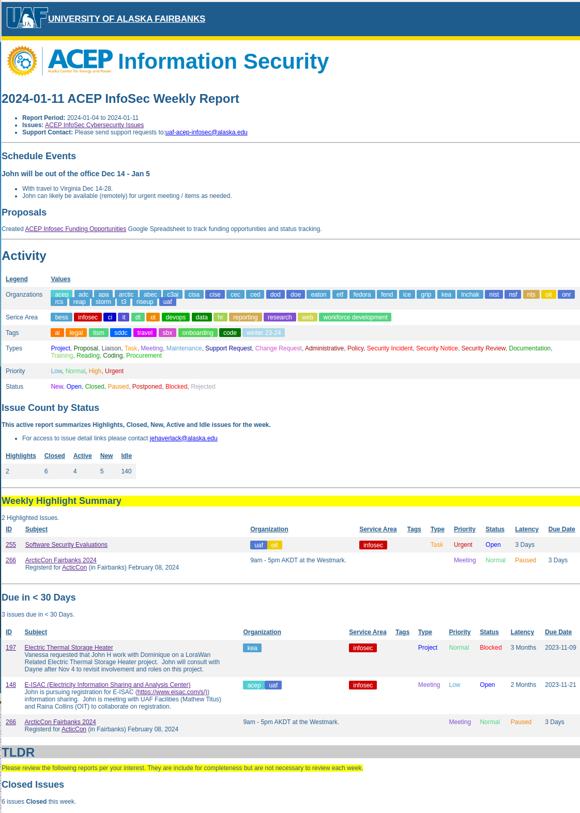

# ACEP Taiga Support Request Report Generator Script

## ACEP Support Request Issues

This script will generate HTML reports for based on Taiga issues for a given Taiga project.




## Pre-Requisites

Install the following software on your local computer.

- Git: https://git-scm.com/
- Node.JS / NPM: https://nodejs.org/en
- jq for Windows: https://stedolan.github.io/jq/download/
- jq for Linux:  ```apt install jq```

### jq on Windows
- rename the jq-win64.exe binary to jq.exe
- move jq.exe to C:\Program Files\Git\usr\bin

## Cloning - Install acep-infosec-reports

- [git@github.com:jehaverlack/acep-infosec-reports.git](https://github.com/jehaverlack/acep-infosec-reports)

1. Open a Git Bash terminal window.
2. Change directory to your **Documents** or other directory of your choosing:

```
cd Documents
```

3. Clone the acep-infosec-reports

```
git clone git@github.com:jehaverlack/acep-infosec-reports.git
```


4. Install NPM Dependancies

```
cd acep-infosec-reports
```

```
npm install
```


### Login Credentials
- copy input/api-credentials-example.json to input/api-credentials.json
- edit input/api-credentials.json with your Taiga Username and Password

### Configure Your Taiga Project

Get the URL from your TAIGA Project issues, e.g.:
```
https://tree.taiga.io/project/jehaverlack-acep-haverlack/issues?order_by=-modified_date
```

The Taiga SLUG in the above URL is:  **jehaverlack-acep-haverlack**

#### Create a Header Issue

In your Taiga Project create a new ticket. The description of this ticket will be used to populate the top of the report to highlight any specific points of interest.  You'll need the Issue Number for this issue in the report config as follows.

#### Edit: input/config.json

Update Custom values for the Report:

-  **REPORT > TAIGA_SLUG**
-  **REPORT > ORGANIZATION**
-  **REPORT > CONTEXT**
-  **REPORT > PERIOD**
-  **REPORT > PERIOD_DAYS**
-  **REPORT > HEADER_ISSUE_NO**

```
{
  "DIRS": {
    "INPUT_DIR":"DIRNAME/input",
 ...
    "REPORT_DIR":"DIRNAME/reports"
  },
  "FILES": {
    "INPUT_CSV":"INPUT_DIR/issues-acep-infosec.csv",
...
    "HTML_FOOTER":"INPUT_DIR/foot.html"
  },
  "REPORT":{
    "ORGANIZATION":"ACEP InfoSec",
    "LOGO":"INPUT_DIR/acep.png",
    "CONTEXT":"Cybersecurity",
    "PERIOD":"Weekly",
    "PERIOD_DAYS": 7,
    "COLLAPSE_STATUSES": false,
    "TAIGA_SLUG":"jehaverlack-acep-haverlack",
    "TAIGA_URL":"https://tree.taiga.io/project/TAIGA_SLUG/issues",
    "TAIGA_TICKET_BASE_URL":"https://tree.taiga.io/project/TAIGA_SLUG/issue/",
    "TAIGA_API_URL":"https://api.taiga.io/api/v1/",
    "HEADER_ISSUE_NO":"40",
    "CONTACT_EMAIL":"uaf-acep-infosec@alaska.edu"
  },
```


## Generating a Weekly Report

### Update the Report Header Issue

1. Goto the Header Issue for your Taiga Report
2. Update the **ACEP Report Header** Description with updated information for this weeks report.

###  Update the Taiga CSV Report

1. Goto your Taiga Project
2. Goto: **Settings** > **Project** > **Reports**
3. **Regenerate** the **Issues Report**
<!-- 4. Click **DOWNLOAD CSV**  and save to the **acep-infosec-reports/input** directory with filename **issues-cfosit.csv** -->

### Generate the Report

1. 1. Open a Git Bash terminal window.
2. Change directory to your **acep-infosec-reports** directory
```
cd Documents/acep-infosec-reports
```
3. Run the **gen_report.sh** script.
```
./gen_report.sh
```

#### Alternate Reports

By default the Report Period is **Weekly**.  You can customize this by passing a different config that the default.

```
./gen_report.sh input/biweekly-config.json
```

```
./gen_report.sh input/monthly-config.json
```


### Viewing the Report:

1. Point your browser to:
- [file:///HOME_DIR/Documents/acep-infosec-reports/reports](file:///HOME_DIR/Documents/acep-infosec-reports/reports)
2. Click on the latest report HTML file.


## Emailing Weekly Reports

1. Copy the HTML content of the report and paste in the Email message.
2. Attache the PDF version of the report.
3. Copy the Report Subject, e.g.:  _ACEP: 2023-04-07 Weekly Report_


